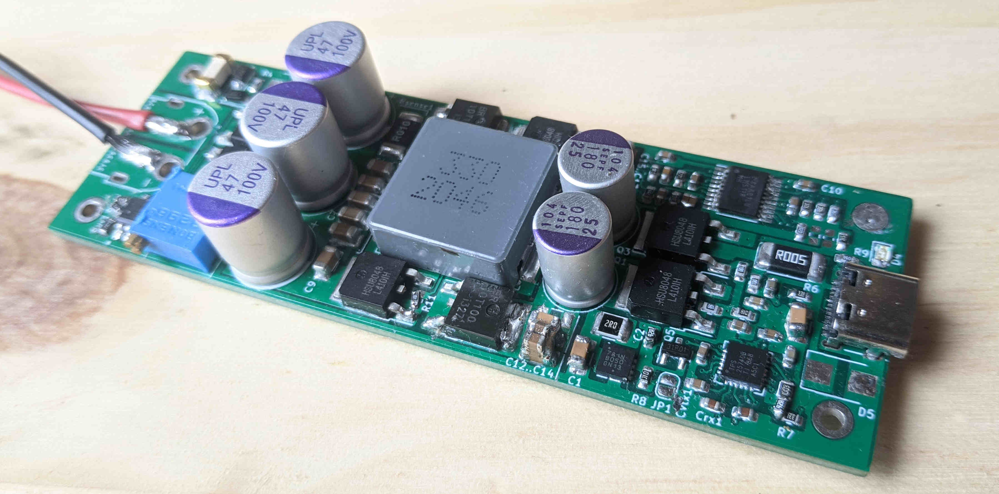

# 10 - 60v input 60w DC to USB-C PD buck-boost converter module using TPS25740B and LM5118

**Status:** 

works, but **poor performance**: excessive (maybe - ?) ripple, especially in boost mode and at higher power levels. Mac laptop charges sucessfully off of it, sometimes. Diodes and inductor heats too much (80c at full load). This might be a straightforward fix, or a more siginficant design error (wrong component choice, values, or layout...)

**Why:**

The goal is that I can charge my laptop off an ebike battery directly, or any other DC source (solar system). No other solution that accepts this high input voltage in existence when I started this, now there is YZ826S from china which does the same thing (which I'll try before continueing to work on this project).

**Prototype:**

**Features:**

* Done in Kicad 6.
* Single-sided board for easy assembly.
* The single-sidedness means that it may be possible in a future revision to replace the remaining THT parts with SMD, and then attach a heatsink or enclosure to the back, for through-the-board cooling.
* As compact as possible.
* Input protection:
     * Reverse-polarity protection provided by two high-side n-channel mosfets back-to-back, driven by HT0440.
     * Inrush current limiting provided by same mosfets, by slowing the switch-on speed significantly.
     * Fuse
     * both of these work well, I will reuse this in other designs.
* Low standby / idle power consumption: the buck-boost converter is disabled when no device (power consumer) connected.
* Adjustable low-voltage cutout.
* Datasheet implementations for TPS25740B and LM5118 are mostly folowed, only the input protection, 5v supply, and power-saving stuff has some clever stuff.
* XT60 power connectors.
* Status indicator LED.

**Warning:** 

TPS25740B seems to be discontinued with no obvious replacement. I had to buy them on Aliexpress. Has some minor bugs (I forgot what exactly. Notably needs an additional / different mosfet somewhere. I'll update this when I find my prototype board where I bodged it on. Also requires one cap around LM5118 replaced with different value).

Play with this at your own risk..